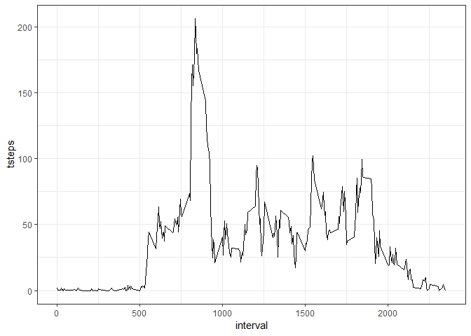
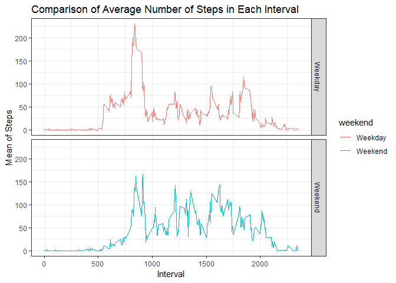

## Loading and preprocessing the data


```r
unzip("activity.zip")
activitydata <- read.csv("activity.csv")
head(activitydata)
```

```
##   steps       date interval
## 1    NA 2012-10-01        0
## 2    NA 2012-10-01        5
## 3    NA 2012-10-01       10
## 4    NA 2012-10-01       15
## 5    NA 2012-10-01       20
## 6    NA 2012-10-01       25
```

## What is mean total number of steps taken per day?
Loading the dplyr package as it is used in the analysis.

```r
library(dplyr)
```

```
## 
## Attaching package: 'dplyr'
```

```
## The following objects are masked from 'package:stats':
## 
##     filter, lag
```

```
## The following objects are masked from 'package:base':
## 
##     intersect, setdiff, setequal, union
```
Grouping the data by date and so that total number of steps by day can be calculated and then plotting the data.

```r
bydate <- activitydata %>% select(date, steps) %>% group_by(date) %>% summarize(tsteps= sum(steps)) %>%na.omit()
hist(bydate$tsteps, xlab = "Total daily Steps",main="Histogram of Total Steps by day", breaks = 20)
```

<!-- -->
The mean and median of the total number of steps taken per day are:

```r
mean(bydate$tsteps)
```

```
## [1] 10766.19
```

```r
median(bydate$tsteps)
```

```
## [1] 10765
```

## What is the average daily activity pattern?
The time series plot of the 5-minute interval (x-axis) and the average number of steps taken, averaged across all days (y-axis) is made as follows:

```r
library(ggplot2)
byinterval <- activitydata %>% select(interval, steps) %>% na.omit() %>% group_by(interval) %>% summarize(tsteps= mean(steps)) 
ggplot(byinterval, aes(x=interval, y=tsteps))+ geom_line() + theme_bw()
```

<!-- -->
The 5-minute interval that, on average, contains the maximum number of steps:

```r
byinterval[which(byinterval$tsteps== max(byinterval$tsteps)),]
```

```
## # A tibble: 1 x 2
##   interval tsteps
##      <int>  <dbl>
## 1      835   206.
```

## Imputing missing values
Calculate and report the total number of missing values in the dataset (i.e. the total number of rows with NAs)

```r
missingvals <- sum(is.na(activitydata$steps))
missingvals
```

```
## [1] 2304
```
Devise a strategy for filling in all of the missing values in the dataset. The strategy does not need to be sophisticated. For example, you could use the mean/median for that day, or the mean for that 5-minute interval, etc. and Create a new dataset that is equal to the original dataset but with the missing data filled in.

I will use the mean for that 5 -minute interval to replace all the missing values in the dataset. At the end, I will check if all the NAs have been replaced.

```r
replacewithmean <- function(x) replace(x, is.na(x), mean(x, na.rm = TRUE))
meandata <- activitydata %>% group_by(interval) %>% mutate(steps = replacewithmean(steps))
head(meandata)
```

```
## # A tibble: 6 x 3
## # Groups:   interval [6]
##    steps date       interval
##    <dbl> <fct>         <int>
## 1 1.72   2012-10-01        0
## 2 0.340  2012-10-01        5
## 3 0.132  2012-10-01       10
## 4 0.151  2012-10-01       15
## 5 0.0755 2012-10-01       20
## 6 2.09   2012-10-01       25
```
Make a histogram of the total number of steps taken each day and Calculate and report the mean and median total number of steps taken per day. 

```r
FullSummedDataByDay <- aggregate(meandata$steps, by=list(meandata$date), sum)
names(FullSummedDataByDay)[1] ="date"
names(FullSummedDataByDay)[2] ="totalsteps"
hist(FullSummedDataByDay$totalsteps, xlab = "Steps", ylab = "Frequency", main = "Total Daily Steps", breaks = 20)
```

<!-- -->
Mean and Median of the imputed data compared to the original data:

```r
oldmean <- mean(bydate$tsteps, na.rm = TRUE)
newmean <- mean(FullSummedDataByDay$totalsteps)
oldmean
```

```
## [1] 10766.19
```

```r
newmean
```

```
## [1] 10766.19
```

```r
oldmedian <- median(bydate$tsteps, na.rm = TRUE)
newmedian <- median(FullSummedDataByDay$totalsteps)
oldmedian
```

```
## [1] 10765
```

```r
newmedian
```

```
## [1] 10766.19
```

## Are there differences in activity patterns between weekdays and weekends?


```r
meandata$date <- as.Date(meandata$date)
meandata$weekday <- weekdays(meandata$date)
meandata$weekend <- ifelse(meandata$weekday=="Saturday" | meandata$weekday=="Sunday", "Weekend", "Weekday" )
```


```r
meandataweekendweekday <- aggregate(meandata$steps , by= list(meandata$weekend, meandata$interval), na.omit(mean))
names(meandataweekendweekday) <- c("weekend", "interval", "steps")

ggplot(meandataweekendweekday, aes(x=interval, y=steps, color=weekend)) + geom_line()+
facet_grid(weekend ~.) + xlab("Interval") + ylab("Mean of Steps") +
    ggtitle("Comparison of Average Number of Steps in Each Interval") + theme_bw()
```

<!-- -->
